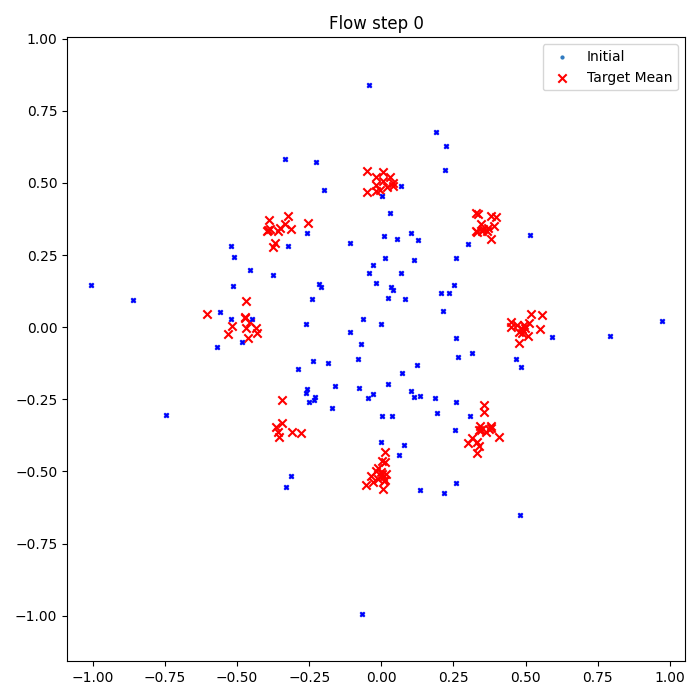

# Conditional Flow Matching with Latent Guidance

This project demonstrates a **flow matching framework** that learns continuous-time dynamics to transport samples from a simple Gaussian source distribution to a complex multimodal target distribution (8 Gaussians) using a neural ODE model. The model is guided by a **conditional latent representation** derived from a VAE.

The approach is based on the paper:
**Anirban Samaddar, Matthew Amodio, Guy Wolf.**
[*Efficient Flow Matching using Latent Variables*](https://arxiv.org/abs/2505.04486), arXiv:2505.04486, 2025.

The code is inspired by TorchCFM: a Conditional Flow Matching library:
[https://github.com/atong01/conditional-flow-matching](https://github.com/atong01/conditional-flow-matching)

## Overview

We train a conditional flow model to match trajectories between source and target distributions. A pretrained VAE provides conditional latent codes (`z`), which are used to condition the vector field. Therefore two types of sampling are supported:

* **Unconditional coverage**: Random latent samples span the entire target distribution.
* **Conditional targeting**: A fixed latent guides the flow toward a specific mode.

**Unconditional Flow Matching**

**Conditioned Flow to a Fixed Mode**

* **Blue stars**: predicted final positions from the learned flow
* **Grey lines**: ODE trajectories over time

## TODO

* [ ] Organize code into a modular project structure
* [ ] Add more flexible sampling modes
